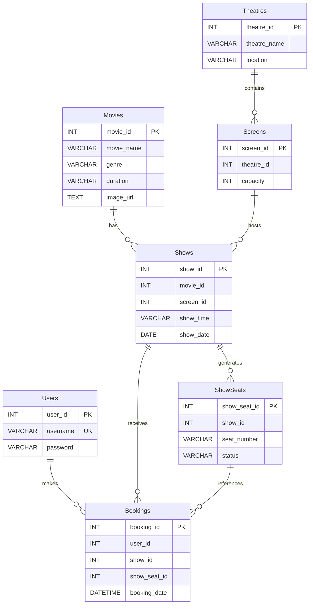

# CineBook

CineBook is a full-stack movie ticket booking system built as a college project with Node.js, Express.js, MySQL, HTML, CSS, and browser-side JavaScript. It provides a database-backed flow for users to register, browse movies, choose theatre shows and seats, complete a simulated payment step, and review or cancel bookings, while an admin panel manages the movie, theatre, screen, and show records used by the application.

## Features

- User registration with username uniqueness validation and a minimum six-character password requirement.
- User login and browser-based login state for the booking pages.
- Movie browsing with movie name, genre, duration, and optional image URL.
- Show listing for a selected movie, including theatre, date, and time.
- Database-backed seat listing with available and booked states.
- Seat selection and booking for one or more seats.
- Transaction-based booking checks that prevent seats already marked as booked from being selected.
- Simulated payment page with a fixed price of ₹150 per selected seat.
- My Bookings page for viewing booked movie and seat details.
- Booking cancellation that releases the associated seats back to `Available`.
- Admin login protected by an admin token in the `Authorization` header.
- Admin listing of movies, theatres, screens, and shows.
- Admin creation of movies, theatres, screens, and shows.
- Automatic seat generation for a new show based on the selected screen capacity, with up to 10 seats per generated row.
- Admin deletion of movies, theatres, screens, and shows where the existing usage checks allow deletion.

## Tech Stack

| Technology | Purpose |
| --- | --- |
| Node.js | JavaScript runtime for the server |
| Express.js | HTTP server, routing, JSON handling, and static file serving |
| MySQL | Persistent storage for users, movies, theatres, shows, seats, and bookings |
| `mysql` | Node.js driver used to connect to MySQL |
| HTML | Page structure for the user and admin interfaces |
| CSS | Shared application styling in `public/style.css` |
| Browser JavaScript | Page navigation, API requests, local state, rendering, and interactions |
| `dotenv` | Loading configuration from the local `.env` file |
| `cors` | Enabling CORS middleware in the Express server |

## System Architecture

```text
User -> Frontend -> Express.js Backend -> MySQL Database
```

- **User:** Interacts with the login, movie, show, seat, payment, booking, and admin pages in a browser.
- **Frontend:** Static HTML, CSS, and JavaScript files in `public/`. The pages call the backend endpoints with `fetch()` and use browser `localStorage` for the current user, selected movie/show, booking summary, and admin token.
- **Express.js Backend:** `server.js` serves the frontend, validates requests, applies admin checks, manages booking and cancellation transactions, and queries MySQL.
- **MySQL Database:** Stores the application records defined in `cinebook.sql`, including users, movies, theatres, screens, shows, generated show seats, and bookings.

## Database Design

The database is created by `cinebook.sql` under the `cinebook` schema. The SQL file defines these tables and columns:

- `Users`: `user_id`, `username`, `password`; `username` is made unique by a later `ALTER TABLE` statement.
- `Movies`: `movie_id`, `movie_name`, `genre`, `duration`, and `image_url` (added by a later `ALTER TABLE` statement).
- `Theatres`: `theatre_id`, `theatre_name`, `location`.
- `Screens`: `screen_id`, `theatre_id`, `capacity`.
- `Shows`: `show_id`, `movie_id`, `screen_id`, `show_time`, `show_date`.
- `ShowSeats`: `show_seat_id`, `show_id`, `seat_number`, `status`.
- `Bookings`: `booking_id`, `user_id`, `show_id`, `show_seat_id`, `booking_date`.

The application uses these logical relationships:

- A theatre has screens through `Screens.theatre_id`.
- A movie and a screen define a show through `Shows.movie_id` and `Shows.screen_id`.
- A show has generated seats through `ShowSeats.show_id`.
- A user books seats through `Bookings.user_id`, `Bookings.show_id`, and `Bookings.show_seat_id`.

The current SQL does not declare foreign-key constraints. The relationships above are represented by the ID columns and enforced through the queries and transaction logic in the server.



## Application Flow

### User Flow

1. **Register/Login:** A user registers or logs in from `login.html`.
2. **Browse Movies:** The application loads movies from the database on `movies.html`.
3. **Select Show:** The user selects a movie and then chooses one of its theatre shows.
4. **Select Seats:** The application loads the show seats and displays available and booked states.
5. **Booking:** The backend checks the selected seats, inserts booking records, marks the seats as `Booked`, and commits the transaction.
6. **Simulated Payment:** The user is taken to `payment.html`, where the total is calculated as ₹150 per seat. The page displays a simulated success message and does not process money.
7. **My Bookings:** The user can view booking details and cancel selected bookings. Cancellation deletes the booking records and makes their seats available again.

### Admin Flow

1. The admin signs in through the admin login form using the configured admin password.
2. The frontend stores the returned token and sends it as a Bearer token for protected admin requests.
3. The admin can view current movies, theatres, screens, and shows.
4. The admin can add a movie, theatre, screen, or show. Adding a show also generates its seats from the screen capacity.
5. The admin can delete movies, theatres, screens, and shows when the server's existing dependency checks permit it. Deleting a show first removes its bookings and seats.

## API Endpoints

| Method | Endpoint | Purpose |
| --- | --- | --- |
| `POST` | `/register` | Register a user. |
| `POST` | `/login` | Validate user credentials and return the user ID and username. |
| `POST` | `/admin-login` | Validate the admin password and return an admin token. |
| `GET` | `/movies` | Return all movies, newest first. |
| `GET` | `/shows/:movie_id` | Return shows for a movie with theatre names. |
| `GET` | `/seats/:show_id` | Return seats and their statuses for a show. |
| `POST` | `/book` | Validate and create bookings for selected seats, then mark them booked. |
| `POST` | `/cancel` | Cancel selected bookings and release their seats. |
| `GET` | `/mybookings/:user_id` | Return a user's booking IDs, movie names, and seat numbers. |
| `GET` | `/admin/movies` | Protected: list movies for the admin panel. |
| `GET` | `/admin/theatres` | Protected: list theatres for the admin panel. |
| `GET` | `/admin/screens` | Protected: list screens with theatre names. |
| `GET` | `/admin/shows` | Protected: list shows with movie and theatre names. |
| `POST` | `/add-movie` | Protected: create a movie. |
| `POST` | `/add-theatre` | Protected: create a theatre. |
| `POST` | `/add-screen` | Protected: create a screen for a theatre. |
| `POST` | `/add-show` | Protected: create a show and generate its seats. |
| `DELETE` | `/delete-movie/:id` | Protected: delete a movie if it has no shows. |
| `DELETE` | `/delete-theatre/:id` | Protected: delete a theatre if it has no screens. |
| `DELETE` | `/delete-screen/:id` | Protected: delete a screen if it has no shows. |
| `DELETE` | `/delete-show/:id` | Protected: delete a show and its bookings and seats. |

Protected endpoints require the token returned by `/admin-login` in the `Authorization: Bearer <token>` header.

## Project Structure

```text
CineBook/
├── public/
│   ├── admin.html
│   ├── booking.html
│   ├── login.html
│   ├── movies.html
│   ├── mybookings.html
│   ├── payment.html
│   ├── shows.html
│   └── style.css
├── cinebook.sql
├── db.js
├── package.json
├── package-lock.json
├── server.js
├── .env                 # Local configuration; ignored by Git
└── .gitignore
```

## Getting Started

### Prerequisites

- Node.js and npm
- A local MySQL server

### Installation

1. Clone the repository:

   ```bash
   git clone https://github.com/saliha711/CineBook.git
   cd CineBook
   ```

2. Install dependencies:

   ```bash
   npm install
   ```

3. Create a local `.env` file using the variables below. Keep real credentials out of source control.

4. Set up the MySQL database:

   ```bash
   mysql -u root -p < cinebook.sql
   ```

5. Start the server:

   ```bash
   npm start
   ```

6. Open [http://localhost:3000](http://localhost:3000) in a browser. The server serves the login page at the root URL. The main pages are `movies.html` and `admin.html`.

## Environment Variables

The application reads the following variables from `.env`:

```env
DB_HOST=localhost
DB_USER=your_mysql_user
DB_PASSWORD=your_mysql_password
DB_NAME=cinebook
DB_PORT=3306
PORT=3000
ADMIN_PASSWORD=choose_an_admin_password
```

`DB_HOST`, `DB_USER`, `DB_PASSWORD`, `DB_NAME`, `DB_PORT`, and `PORT` have defaults in the implementation when omitted. `ADMIN_PASSWORD` also has a development fallback in `server.js`; set it explicitly for local use rather than relying on that fallback.


## Security and Limitations

- User passwords are currently stored and checked using the existing plain database value approach. This is suitable for demonstrating the college project but is not production-grade credential storage.
- User authentication returns user information to the browser and relies on browser `localStorage`; there is no server-side user session or JWT-based user authentication.
- Admin access uses a password-derived token and browser `localStorage`, so the current mechanism is intended for the project environment rather than production authorization.
- Payment is simulated in the frontend and does not process real money or connect to a payment gateway.
- The application depends on a locally available MySQL database for development.
- CORS middleware is enabled globally, and the application is configured as a local Express server rather than a production deployment.
- The database schema uses logical ID relationships but does not currently define foreign-key constraints.

## Future Improvements

The following are potential improvements and are not currently implemented:

- Hash passwords with `bcrypt` and add appropriate credential handling.
- Use secure server-side sessions with `httpOnly` cookies or a carefully designed JWT flow.
- Add stronger admin authorization and token/session lifecycle management.
- Integrate a real payment gateway with server-side payment verification.
- Add database foreign-key constraints and more comprehensive validation.
- Improve booking concurrency handling and enforce seat uniqueness at the database level.
- Add automated tests, structured logging, and production deployment configuration.

## Author

Saliha S A  
B.Tech Computer Science & Design  
FISAT

## GitHub

[CineBook repository](https://github.com/saliha711/CineBook)